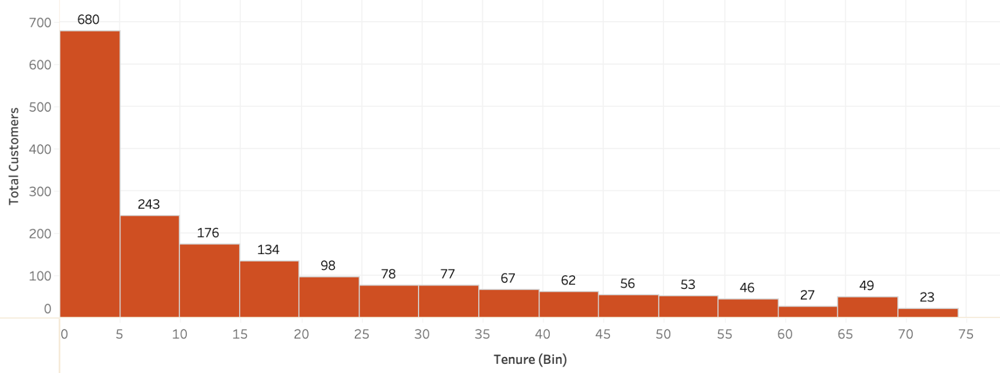
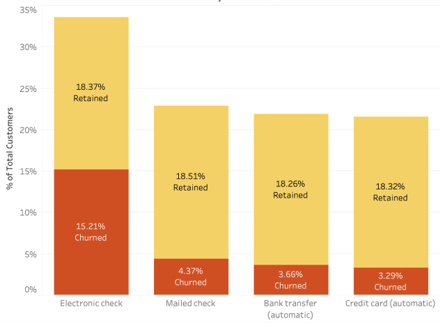

# Customer Churn Analysis Overview

Customer churn is a critical metric for businesses, as it measures the rate at which customers stop doing business with a company. This analysis aims to understand churn behavior by exploring customer demographics, service preferences, and payment methods. Insights are used to craft data-driven recommendations for improving customer retention.

## Key Takeaways: Customers who have month-to-month contracts and do not have dependents or partners are more likely to churn.

## Table of Contents

1. [Customer Churn Analysis Overview](#customer-churn-analysis-overview)
2. [Business Problem](#business-problem)
3. [Data Source](#data-source)
4. [Process](#process)
5. [Methods](#methods)
6. [Brief Results](#brief-results)
7. [Insights](#insights)
8. [Lessons Learned](#lessons-learned)
9. [Recommendation](#recommendation)
10. [Limitations](#limitations)

 

---

## Business Problem
What factors are most strongly associated with customer churn in telecommunications services, and how can targeted strategies be developed to mitigate these drivers and enhance customer retention and profitability?

## Data Source
- [Kaggle Telco Customer Churn](https://www.kaggle.com/rikdifos/credit-card-approval-prediction](https://www.kaggle.com/datasets/blastchar/telco-customer-churn/data))

## Process
- **Excel**: Cleaned and standardized data using Power Query (missing values, format changes).
- **SQL**: Performed EDA and segmented customers to identify churn patterns.
- **Tableau**: Visualized insights to develop strategies for churn reduction and retention.

## Methods
- Data Cleaning
- Exploratory Data Analysis (EDA)
- Customer Segmentation
- Correlational Analysis
- Customer Retention Strategy

 
  
---

## Brief Results

### Churn Distribution by Tenure:

### Churn by Payment Method:

### Customer Churn by Contract:

### Customer Demographic:

| Partner | ChurnRate |
|---------|-----------|
| No      | 17.04     |
| Yes     | 9.5       |

| Dependents | ChurnRate |
|------------|-----------|
| No         | 21.91     |
| Yes        | 4.63      |

 

---

## Insights

- **Tenure**: The **highest churn rate** is observed within the first **5 years**, with **680 customers leaving during this period**. Churn decreases as tenure increases, indicating that **early stage retention efforts should be prioritized**. This could be because customers often use the initial months or years to test the product and assess its value. Improving personalized engagement, early support, and price to value match could help reduce churn in these critical stages.

- **Payment Method**: Customers using **electronic checks 15.21% exhibit a higher churn rate**, suggesting that **flexibility and control over payments** may lead to a higher likelihood of churn. In contrast, customers who use **automatic payment methods**, such as bank transfers and credit cards, have **significantly lower churn** rates, indicating that these customers may exhibit **greater commitment and financial stability**. **Mailed check users** also show a relatively **low churn** rate, possibly reflecting a more **traditional and loyal customer segment**.

- **Contract**: The **majority of churned customers** were on **month-to-month contracts 88.55%**, suggesting that the **lack of long-term commitment** in these contracts is a **significant driver of churn**. In contrast, customers on one-year and two-year contracts exhibit lower churn, indicating that longer commitments may help improve retention.

- **Demographic**: **Churned customers without dependents or partners** experience **higher churn rates** compared to those who do. Churned customers **without dependents have a rate of 21.91%** while **churned customers without partners have a 17.04% churn rate**, This suggests that customers **without a partner** may lack support, making them **more cost-sensitive** and more likely to seek alternatives. On the other hand, those **with dependents** may be more incentivized to stay long-term, driven by increased stability or greater **reliance on the service**.

## Lessons Learned

**Data quality is really important** having more complete datasets, especially with more customer details can lead to better insights. Customer segmentation was key in identifying high risk groups and creating targeted retention strategies. 

## Recommendation

- **Incentivize Long-Term Contracts**
Offer discounts or exclusive benefits to customers who commit to 1 or 2 year contracts. This will increase customer retention by reducing churn from month-to-month contracts.

- **Encourage Automated Payment Methods**
Promote the use of credit cards or bank transfers instead of electronic checks by offering small discounts or loyalty rewards for customers who sign up for automatic payments. This will increase customer stability and reduce churn.

- **Target Non-Partnered Customers with Long-Term Commitment Incentives**
Since customers without a partner tend to have higher churn rates, create tailored offers that emphasize long-term benefits or individual-focused plans. Consider offering personalized discounts, loyalty rewards, or flexible plans that cater to their unique needs, which can help foster greater engagement and encourage longer-term commitment.

## Limitations

The analysis was limited by the lack of essential **demographic** and **product related data**, such as **age**, **salary**, and **detailed service pricing**.

- **Age and Salary Data**: Without this, it was difficult to segment customers based on their financial profiles and tailor retention or pricing strategies accordingly.
- **Service Pricing Data**: The absence of detailed pricing information made it hard to assess price sensitivity or determine if churn was due to dissatisfaction with service value.

Incorporating these data points would have enabled a more comprehensive understanding of customer behavior and improved retention strategies.

 

---

## Further Exploration

- **[Interactive Tableau Dashboard](https://public.tableau.com/app/profile/aileen.q/viz/TelcoCustomerChurn_17359555698340/Dashboard2?publish=yes):** Explore the visualizations and analysis interactively on Tableau Public.  

