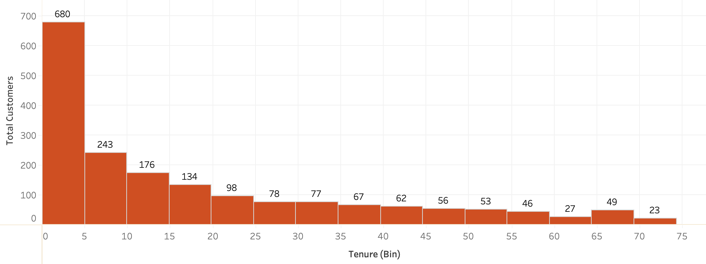
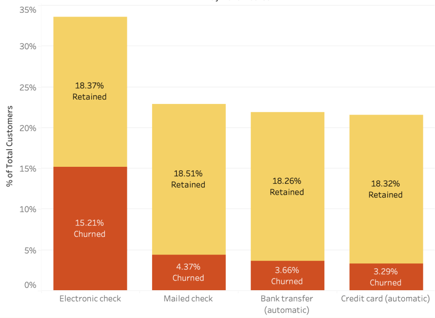
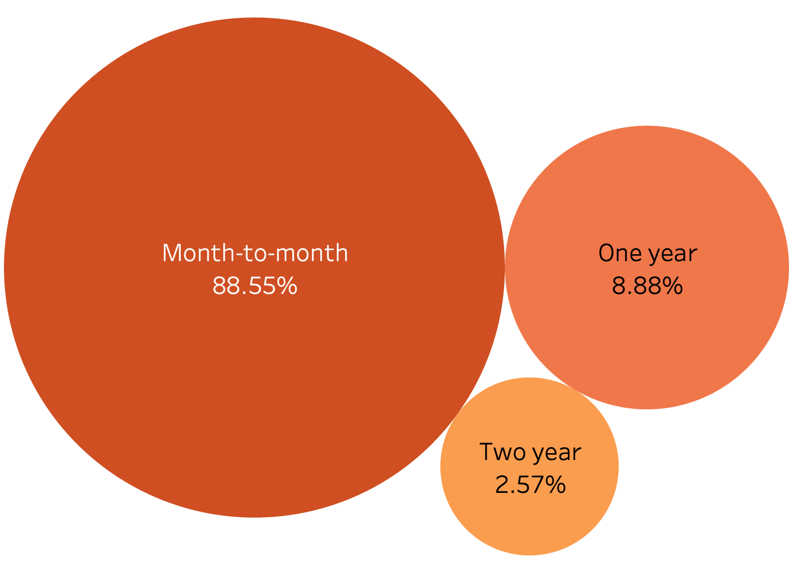

# **Customer Churn Analysis Overview**

Customer churn is a critical metric for businesses, as it measures the rate at which customers stop doing business with a company. This analysis aims to understand churn behavior by exploring customer demographics, service preferences, and payment methods. Insights are used to craft data-driven recommendations for improving customer retention.

## Key Takeaways: Customers who have month-to-month contracts and do not have dependents or partners are more likely to churn.

## Table of Contents

1. [Customer Churn Analysis Overview](#customer-churn-analysis-overview)
2. [Skills Demonstrated](https://www.notion.so/Github-175c2e344087804eb9a7f48984a5d236?pvs=21)
3. [Data Source](https://www.notion.so/Github-175c2e344087804eb9a7f48984a5d236?pvs=21)
4. [Key Findings](https://www.notion.so/Github-175c2e344087804eb9a7f48984a5d236?pvs=21)
5. [Repository Structure](https://www.notion.so/Github-175c2e344087804eb9a7f48984a5d236?pvs=21)
6. [Getting Started](https://www.notion.so/Github-175c2e344087804eb9a7f48984a5d236?pvs=21)
7. [Future Work](https://www.notion.so/Github-175c2e344087804eb9a7f48984a5d236?pvs=21)
8. [Contact](https://www.notion.so/Github-175c2e344087804eb9a7f48984a5d236?pvs=21)

 

---

# **Business Problem**
What factors are most strongly associated with customer churn in telecommunications services, and how can targeted strategies be developed to mitigate these drivers and enhance customer retention and profitability?

# **Data Source**
- [Kaggle Telco Customer Churn](https://www.kaggle.com/rikdifos/credit-card-approval-prediction](https://www.kaggle.com/datasets/blastchar/telco-customer-churn/data))

# **Process**
- **Excel**: Cleaned and standardized data using Power Query (missing values, format changes).
- **SQL**: Performed EDA and segmented customers to identify churn patterns.
- **Tableau**: Visualized insights to develop strategies for churn reduction and retention.

# **Methods**
- Data Cleaning
- Exploratory Data Analysis (EDA)
- Customer Segmentation
- Correlational Analysis
- Customer Retention Strategy

 
  
---

# **Brief Results**

## Churn Distribution by Tenure

## Churn by Payment Method

## Customer Churn by Contract

## Customer Demographic

| Partner | ChurnRate |
|---------|-----------|
| No      | 17.04     |
| Yes     | 9.5       |

| Dependents | ChurnRate |
|------------|-----------|
| No         | 21.91     |
| Yes        | 4.63      |

 

---

# **Insights**

**Tenure**: The **highest churn rate** is observed within the first **5 years**, with **680 customers leaving during this period**. Churn decreases as tenure increases, indicating that **early stage retention efforts should be prioritized**. This could be because customers often use the initial months or years to test the product and assess its value. Improving personalized engagement, early support, and price-to-value match could help reduce churn in these critical stages.

**Payment method**: Customers using **electronic checks exhibit a higher churn rate**, suggesting that **flexibility and control over payments** may lead to a higher likelihood of churn. In contrast, customers who use **automatic payment method**s, such as bank transfers and credit cards, have **significantly lower churn** rates, indicating that these customers may exhibit **greater commitment and financial stability**. **Mailed check users** also show a relatively **low churn** rate, possibly reflecting a more **traditional and loyal customer segment**.

